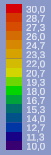
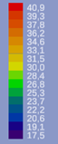

# SVEN Thermal Simulation
*This was the original source repository for the project. The entire project can be found [here](https://github.com/Projekt-SVEN).*

SVEN is the name of a Smart Lecture Hall project. It had the goal to adapt the room actuators (e.g., radiators, window covers, fresh air ventilation) to the user usage, outside temperature, weather forecast, etc. to maximize the energy efficiency and minimize the energy usage. 

Due to the COVID-19 pandemic, the developed system could not be tested under real conditions, as it was temporally planned in the summer semester 2020. For this reason, after considering several options, the decision was made to develop a simulation. This has the task to simulate the thermal behavior of a room, its contained objects (e.g. heating, windows) and the users, as well as the movement behavior of the users, in order to evaluate the potential performance of the system in an approximated way. The simulation could not be completed during the project period.

The game engine Unity is used to visualize the simulation. This was also used in parallel in the event "Mixed Reality" by Prof. Dr.-Ing. Adler, who was gladly available as a contact person for problems concerning Unity.

## Authors

- Dominik Viererbe 
- Tobias Wawrik
- Fritz Niemann

## About

This section was translated with [DeepL](https://www.deepl.com/translator) from my [original technical explaination in german](https://github.com/Projekt-SVEN/Simulation).

### Thermal Simulation

For the simulation of thermodynamic behaviors, the finite element method, a numerical method for solving differential equations, is applied to the thermodynamic equations of heat conduction. Here, the space is divided into finitely small regions ("finite elements") and the interactions between the elements, repeated for a discrete time interval, are calculated. The size of the "finite elements" and the time interval has a great influence on the accuracy of the simulation.

The thermodynamic effects of thermal convection and thermal radiation were not implemented because both effects have a higher complexity for which resources were not available in the already ambitious schedule. In particular, the realistic simulation of fluids is highly non-trivial. The Navier-Stokes equations, which are a mathematical model of the flow of linear-viscous Newtonian fluids, are notoriously hard to solve and are even part of the seven Millennium Problems, each of which has a prize of one million U.S. dollars at stake and only one of which has been solved so far (as of Aug. 27, 2020).

The space is approximated by a two-dimensional model. This significantly reduces the effort of visualization and simulation, since a two-dimensional scalar field, which assigns a temperature to each point in space, is easier to represent and requires only a fraction of the physical interactions and memory of a three-dimensional scalar field.

This model approximates a room as a rectangle defined by the parameters room size, room position and wall thickness. Furthermore, a room can interact with thermal objects9 . Thermal objects also have a size and position, as well as a thermal surface, thermal material, temperature, and an indicator whether the thermal object can change position at runtime, which, however, only serves the purpose of runtime optimization. The thermal object can change these properties at runtime as opposed to space. The initial parameters for this are read from an XML file.

The space is divided by a previously defined edge length `x` into equally sized squares ("finite elements") whereby each "finite element" has four neighbor "finite elements".

If a frame is to be calculated by the Unity engine for visualization, it is determined how much time `𝛿t_LastFrame` has passed since the calculation of the last frame. Here, `𝛿t_LastFrame` is divided by a previously determined constant time interval `𝛿t` to calculate the number of loop passes. This decouples the value `𝛿t` from `𝛿t_LastFrame`, which can fluctuate greatly. Since only a discrete number `n ∈ ℕ0` of loop passes can be made, the number of loop passes is rounded down to the next smallest integer and the remaining time is added to `𝛿t_LastFrame` of the next frame.

During a loop pass, the heat flux 𝛿Q/𝛿t is calculated for each "finite element". This results from the sum of the partial heat flows `𝛿Q_i/𝛿t`.

`𝛿Q/𝛿t = ∑ (𝛿Q_i/𝛿t)`

Although the space has only a two-dimensional extension, it was assumed here that a "finite element" has the height `h=x` and thus represents a cube, whereby the cross-sectional area is calculated as follows:

`A = x ∙ h = x²`

The distance between the centers of two "finite elements" is as large as the edge length of a "finite element" `l=x`, because the "finite elements" are all squares of the same size, which are arranged in a checkerboard pattern.

`⇒ 𝛿Q_i/𝛿t = x²∙ (𝜆 / x) ∙ (T0 − Ti) = 𝜆 ∙ x ∙ (T0 − Ti)`

If two adjacent "finite elements" have different thermal materials, the partial heat flux is calculated using the heat transfer coefficient `𝛼` of the two thermal materials:

`𝛿Q_i/𝛿t = A ∙ 𝛼 ∙ (T0 − Ti)=x2∙ 𝛼 ∙ (T0 − Ti)`

When calculating the heat flow between a thermal object and the "finite elements", it is first calculated which "finite elements" lie completely or only partially within the area of the thermal object. For thermal objects that have an indicator that they do not change their position, that calculation is performed only once. The share of the "finite element" in the thermal surface of the thermal object is used as the cross-sectional area `A` for the calculation of the partial heat flux. The heat transfer coefficient between the thermal materials of the "finite element" and the thermal object is also used for this purpose.

After all heat fluxes are calculated, it is calculated how much heat `𝛿Q` was transferred within the time interval `𝛿t`.

`𝛿Q/𝛿t ⇒ 𝛿Q = (𝛿Q/𝛿t) ∙ 𝛿t`

For "finite elements", the temperature change is calculated using the specific heat capacity of the thermal material.

`𝛿Q = m ∙ c ∙ 𝛿T ⇒ 𝛿T = 𝛿Q / (m ∙ c)`

Only the value of the transferred heat `𝛿Q` is passed to thermal objects. Each thermal object implements its own thermal behavior based on the value passed. This mechanism takes advantage of the "open-closed principle" because in the future, new thermal objects must implement only the interface.

Furthermore, thermal simulation takes advantage of the "dependency inversion principle", since concrete implementations of the abstract interfaces and parameters are passed to the simulation logic at runtime via "dependency injection". This leads to a loose coupling between the simulation logic and the dependencies of that logic.

Before the simulation starts, a room temperature and an outdoor temperature are specified. The outdoor temperature can be changed while the simulation is running. Each "finite element" of the interior and the wall is initialized with the room temperature by a random deviation of ±0.5°C. All "finite elements" that do not belong to the interior of the room or wall have permanently the outdoor temperature, which is not changed even if heat is added, because the heat exchange of a room with the environment almost always exerts a negligible effect on the average ambient temperature.

### External connection of the building automation server FHEM

Since the evaluation of FHEM is the main goal of the simulation, the simulation must be able to interact with FHEM. For this purpose, virtual devices were created in the FHEM building automation server, which take on the role of real sensors or actuators for the FHEM logic.

In the simulation one finds analogously external objects18, which offer interfaces for the interaction with the simulation. Each external object holds a reference to a server connection. Here, too, the "open-closed principle" and "dependency inversion principle" were applied, since new, external objects can be easily added by implementing the interfaces and a loose coupling between the objects of the simulation and the external objects is created by "dependency injection", which was particularly helpful for tests, since the simulation did not have to be tested with a real connection to FHEM in the initial phase, but was also functional with a "mockup" of the server connection interface.

The concretely used implementation of the server connection interface interacts via the FHEM HTTP API. For example, if a window is opened in the simulation, then the concrete, external window object makes a corresponding HTTP post request, which sets the virtual FHEM window contact to open.

The disadvantage of the HTTP connection is that read accesses, as for example with the timetable, are only possible via polling. To limit the overhead, almost every external object has a read cache that is invalidated at periodic time intervals or during write operations.

### User behavior

The model for user behavior is based on simplified team member experiences relevant to thermal simulation.

Users can assume the role of either student or lecturer, but only one lecturer can be in the room at any time.

If there is no lecture according to the schedule information, users leave the room. This rule is executed under all circumstances, while all following rules are subject to restrictions.

During breaks, the lecturer sits on his chair while some of the students move freely around the room. Whether a student stays seated or gets up to move is realized by using a pseudorandom number generator and a predefined percentage.

In the lecture, students sit down while the lecturer moves randomly around the room.

If a user is too cold or too hot during the break or the lecture, he goes to the tablet of the room and opens or closes windows, if necessary, or adjusts the set temperature.

To prevent a user from walking through objects, such as tables, a pathfinding algorithm was developed. From the parameters describing the structure and content of a room, a graph is created containing the paths along which a user can move, which was visualized using MATLAB for room 9.428 as an example.

If the decision is made for the simulated user to move to a certain point in space, the shortest path to that point is calculated via the A* algorithm. This is on average faster than Dijkstra's algorithm, because the A* algorithm belongs to the informed searches by using a heuristic.

To vary the speed at which people move through space, each person is assigned a pseudorandom number from 0 to 1 (including thresholds) during initialization. Before the simulation is started and while the simulation is running, the minimum and maximum movement speed can be set. The motion velocity results from the bijective linear mapping of the random value to the interval between the minimum and maximum motion velocity (including the threshold values).

The same principle is used for the temperature sensation of a user. When a person is initialized, a pseudo-random number between 0 to 1 (including the thresholds) is assigned for the minimum and maximum comfort temperature, both of which are mapped to fixed intervals to determine a person's minimum and maximum comfort temperature.

Through these processes, the person's behavior is more varied, which is closer to reality.

In the last stage of development of the simulation, the user behavior could not be fully realized. The program code for all the functions described here has been written, but errors occurred during tests, the cause of which is as yet unclear. For example, some scripts repeatedly report null pointer exceptions when accessing external dependencies. However, these should have been assigned during initialization via "dependency injection", which has worked without errors in past versions. To make matters worse, these and other errors only occur randomly. This could be an indication that a raise condition is present, which are notoriously difficult to detect by conventional debugging.

### Visualization

To visualize the air temperatures, squares were created whose size can be adjusted. In order to be able to represent the temperature by colors, certain color values were assigned to certain temperatures. The selection of the colors was made after a vote in the simulation team.

For the interpolation of a color the basic colors are needed, which is included by the temperature. Furthermore, the difference between the temperature, which represents the warmer color value, and the temperature of the pixel to be calculated is required. With the help of these 3 parameters the color value is interpolated. This calculation must be done for the red, green, and blue parts of the colors. It should be noted that this calculation must not be performed if the pixel to be calculated is the warmest one, otherwise an error 19 would occur.

Figure 3: Static Scaling

Figure 4: Dynamic Scaling

The user was also given the option to choose between static and dynamic scaling. The differences can be seen in the two figures above. The static scaling allows the detection of smaller temperature differences, if this is necessary. For this, only the highest and lowest temperature must be specified, the intermediate values are then calculated from this. If the static temperature scaling is activated, it may happen that there is a temperature in the room that is lower than the lowest temperature set in the scaling. In this case the coldest color value will be selected.

Both wall and air pixels must be able to store a temperature and reproduce it.

For a more detailed representation of the room, room elements should be added with which a simulated user can interact if necessary. Examples would be chairs, doors, windows and heaters.

## License

SVEN Simulation    
Copyright (C) 2020-2022 Dominik Viererbe, Tobias Wawrik, Fritz Niemann

This program is free software: you can redistribute it and/or modify it under the terms of the GNU Affero General Public License as published by the Free Software Foundation, either version 3 of the License, or *(at your option)* any later version.

This program is distributed in the hope that it will be useful, but WITHOUT ANY WARRANTY; without even the implied warranty of MERCHANTABILITY or FITNESS FOR A PARTICULAR PURPOSE. See the GNU Affero General Public License for more details.

You should have received a copy of the GNU Affero General Public License along with this program. If not, see <<https://www.gnu.org/licenses/>>.